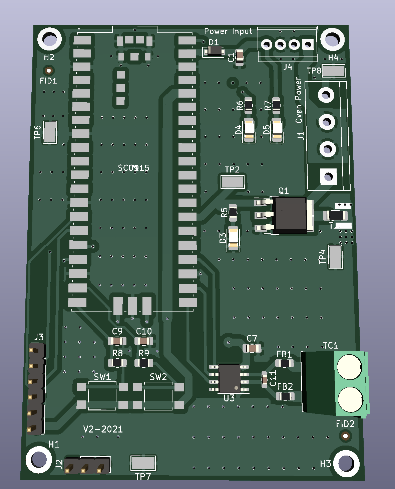

# Oven-Controller-Hardware

This project is about creating a controller for a heating element for a custom designed oven. The temperature needs to be controlled with industrial precision, so this baord contains a microcontroller as well as devices needed to interact with a thermocouple to precisely sense temperature, as well as a large power mosfet, which controls the power to the heating element to control the temperature with great accuracy. 

# Design

because of the supply shortage, the microcontroller was chosen as a RP2040 already made onto a Raspberry pi Pico board, because that board can be soldered onto another, as in this case, and both the RP2040, and my second choice of STM32F0 controllers are impossible to buy for any project currently. So buying a premade micro offers flexability as you can buy them in the quantities I need. the Micro interacts with both the sensor and mosfet, as well as capability to drive an LCD screen for display. A notable thing that is different here is that the mosfet does not use a large heatsink. That is not because it does not disspate much power, but because the newer technology on the market allows the Vishay thermal jumper to absorb and funnel much of the heat directly from the heat fin into the ground plane.

# Hardware
this was a standard layout, fairly straight forward. as components were placed and grouped, and then power connections ran, and then the rest of the connections, and then a gnd plane. 

the mockup

Version 1 has already been manufactured, and is currently in the firmware design stage. The major differences in design from version 1 is that it had SMPS on th board, which has now been broken into a separate board to allow for better space usage, a smaller footprint, and better thermal design for the SMPS.

